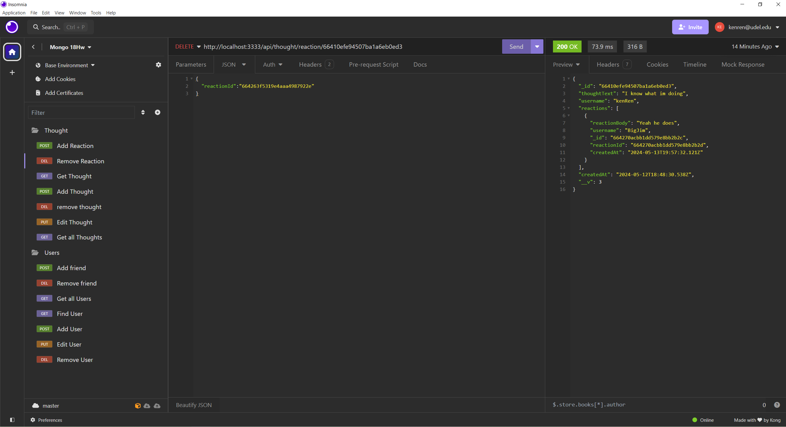

# Social_Network_Backend_API

## Table of Contents 
- [Description](#description)
- [Installation](#installation)
- [Usage](#usage)
- [License](#license)
- [Credits](#credits)
- [Questions](#questions)

## Description
Make a Social Media API with the data stored in mongodb
## Installation
Clone the repository and type npm i. Then type npm start
## Usage

## Credits
Kendell Rennie 
  
### third-party-programs
mongodb  
express  
mongoose  

## License
MIT
## Badges

## How to Contribute
If you like to contribute, my github username is dellman000

## Questions
If you have any questions, please contact me at kenren@udel.edu  
Link to my github profile page https://github.com/dellman000
 
    